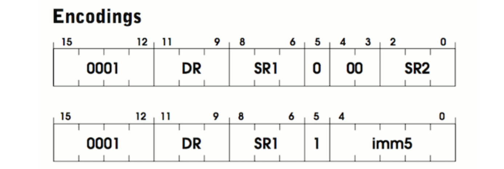

ADD instruction  

Register mode (bits 3 and 4 are unsused):  
```assembly
ADD R2 R0 R1 ;add the contents of R0 to R1 and store in R2
```

Immediate assembly (usually used as a counter -- biggest int 2^5 == 32):  
```assembly
ADD R0 R0 1 ;add 1 to R0 and store back in R0
```  

Encodings (ADD):  
1. first one is the register mode  
2. second is the immediate mode  
  

> source: [image reference](https://justinmeiners.github.io/lc3-vm/)  
