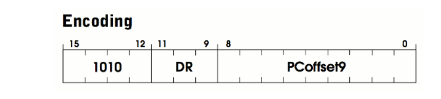

## LDI  

What is LDI?  
Load indirect. Load a value from a location in memory into a register  

Encoding:  
`1010`: is the opcode for the instruction -- OP_LDI  
`DR`: 3 bits -- destination register  
`PCoffset9`: immediate value embedded in the instruction  


```c
//destination register
uint16_t r0 = (instr >> 9) & 0x7;

//PCoffset9
uint16_t pcOffset = signExtend(instr & 0x1FF, 9);

//add pcOffset to the current PC, look at that memory location to get final
address
reg[r0] = memRead(memRead(reg[R_PC] + pcOffset));

updateFlags(r0);
```



> An address is computed by sign-extending bits [8:0] to 16 bits and adding
> this value to the incremented `PC`. What is stored in memory at this address
> is the address of the data to be loaded into `DR`. - page 532.  

## Reference:  
Overview of the LC-3 Architecture - [PDF](https://justinmeiners.github.io/lc3-vm/supplies/lc3-isa.pdf)  
